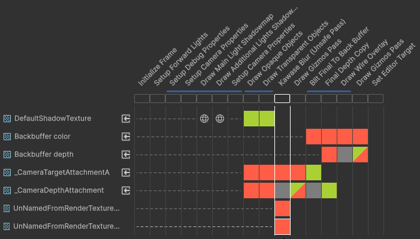

## Kawase Blur for URP 17 with Render Graph API Support

### Copyright notice
Please note, the original creator of this repository (sebastianhein) did not license it. This means the original code is technically copyrighted.

However, due to extensive modifications required to adapt this effect to the Rendering Graph API this project now contains no original code. Therefore I'm taking libery to post current fork under the `MIT Licence`.

## Renderer Features

This project contains two experimental RenderFeature implementations that implement a post-processing-like effect in URP using ScriptableRenderFeatures and provide a simple yet effective blur, based on the Kawase blur as described in this [article](https://software.intel.com/en-us/blogs/2014/07/15/an-investigation-of-fast-real-time-gpu-based-image-blur-algorithms).

### KawaseBlurRenderGraph.cs
* renders multiple passes using modern Render Graph idioms for resource management and pass execution

### KawaseBlurRenderGraphUnsafePass.cs
* renders single pass containing the entire blur loop

### KawaseBlur.shader
* Shader is rewritten in HLSL

## Demo location
#### Assets/Demo/Demo.unity

## Features

* variable number of blur passes
* downscaling

## Compatibility
I deliberalety dropped out legacy support of older API's through compartibility mode. That means this render features can be used only in Unity 6 URP 17 and above. If you need prior versions - check [other forks](https://github.com/tomc128/urp-kawase-blur/forks).

### Download
Download this project using the releases tab. The unitypackage contains all the files needed to setup the blur effect. The demo scene is included.

Blur originally developed with Unity 2019.3.
Demo scene & project restructure done with Unity 2020.1.
Render Graph support added using Unity 6000.0.50
